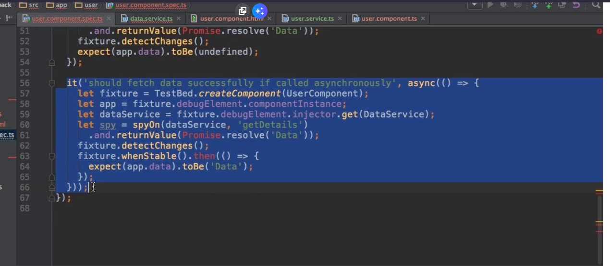

A Basic Introduction to Unit Testing in Angular Apps

## Why Unit Tests?

So this will be some non-angular flavored tests.

The way we write correct tests is NOT what we are going over, just how testing can be useful btw.

## Analyzing the Testing Setup (as created by the CLI)

_This is in the app.component.spec.ts_

So none of these blocks influence/care about the other...

Testing/Karma(testing package) related methods include "Expect" and "It" (which is in "expect")

## Adding a Component and some fitting Tests

Makin' a User component

with a new fixture for a testbed for user component, and making a let app debug element runs the debug in an instance.

    ng test

Oooh neat! It brings it up in Chrome.

Using a new service

We are using the A2 Injector, get an instance of the user's service. Can learn more ways of injecting in the docs later in the module.

OH sHOOT! That's how it's SUPPOSED to be written!!

This part is testing the testing software, not your app itself. But it's here to show us the difference between the two?

## Using "fakeAsync" and "tick"

BUT WAIT! There's another way we can run this test

to tHIS!

Gets rid of the lets. stable test... Tick basically means in a fake async environment finish all async tests NOW. We solve it immediately, we don't want to wait while this test is running to get the data.

We can use the previous setup or fake async it takes the same time, different philosophy. In one you fake test, the other you go yep got it let's goooo.

## Isolated vs Non-Isolated Tests

**Making a "reverse-pipe.ts" file.**

**Making a reverse.pipe.spec.ts file***

This Module only provides a brief and basic Introduction to Angular Unit Tests and the Angular Testing Suite. This Course isn't focused on Testing.

If you want to dive deeper, the official Docs actually are a great place to start. There you'll also find a Non-CLI Setup!

Official Docs: https://angular.io/docs/ts/latest/guide/testing.html

I can also recommend the following Article: https://semaphoreci.com/community/tutorials/testing-components-in-angular-2-with-jasmine

For more Information on how to run Tests with the CLI have a look at their official Docs:

=> Unit Tests: https://github.com/angular/angular-cli/wiki/test

=> E2E Tests: https://github.com/angular/angular-cli/wiki/e2e